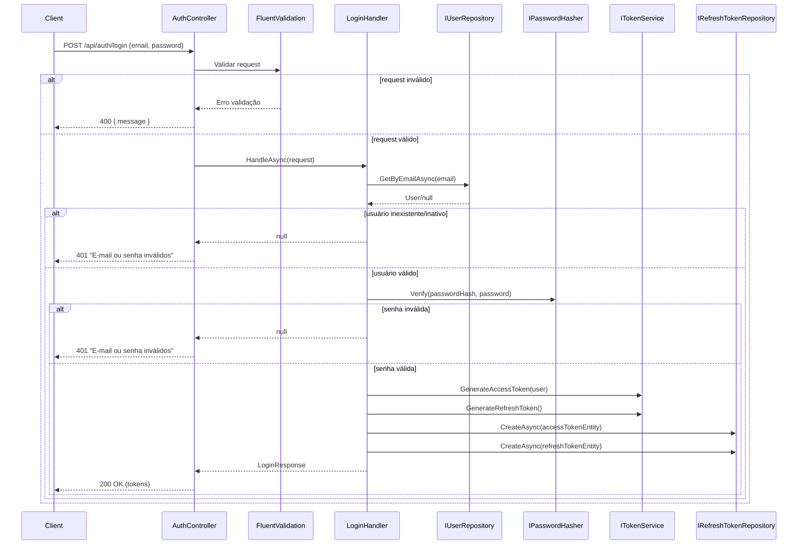
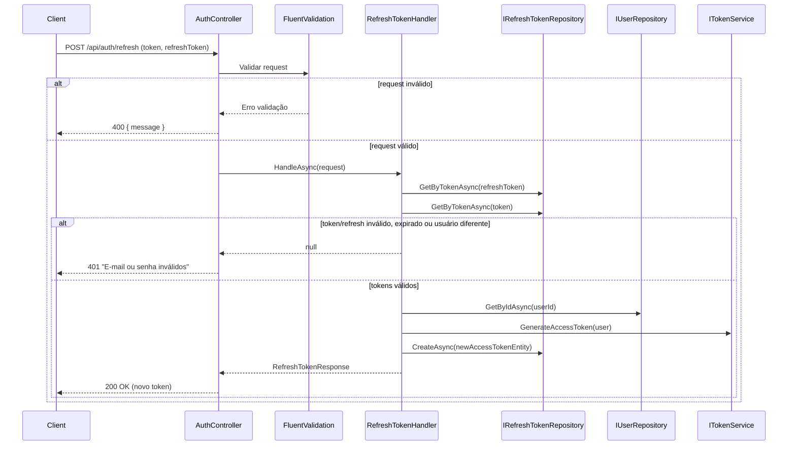
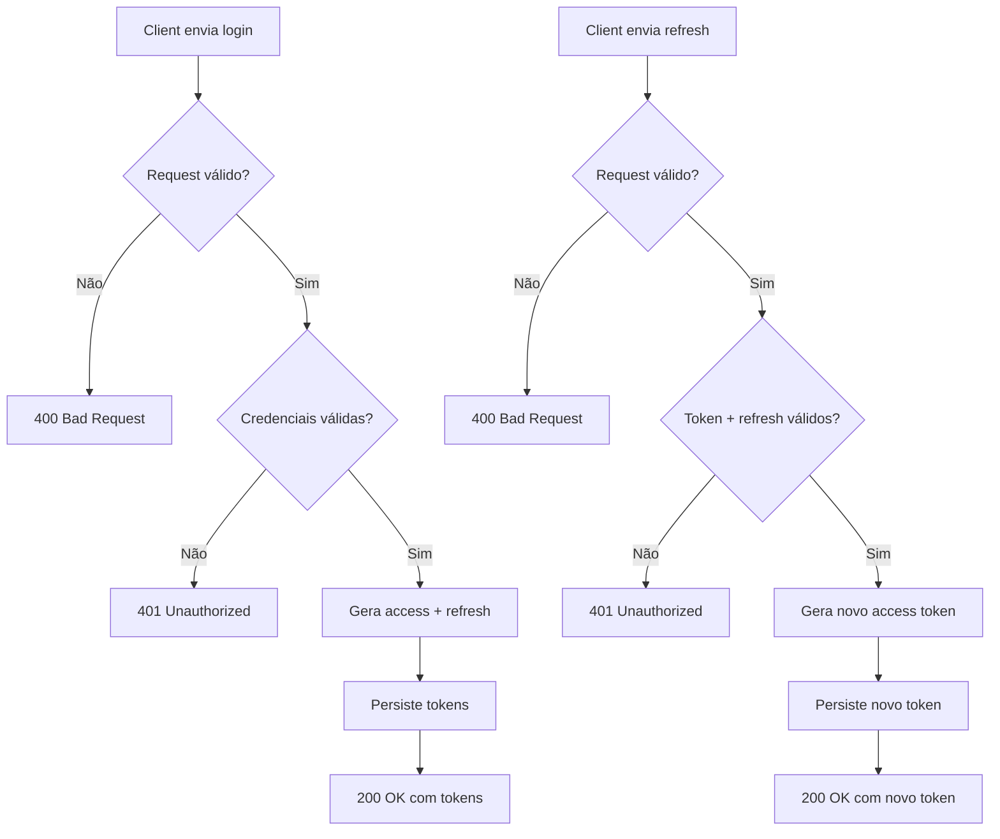

## Autenticação e Renovação de Token (`Authorization`)

Este documento descreve o fluxo completo de **login** e **refresh token** da API do `CafeSystem`, com base na implementação atual.

---

## Visão geral

O processo de autenticação é dividido em 2 operações principais:

1. **Login** (`POST /api/auth/login`)
   - recebe `email` e `password`;
   - valida formato e obrigatoriedade dos campos;
   - valida credenciais no banco;
   - gera `access token` + `refresh token`;
   - persiste tokens no banco;
   - retorna tokens para o cliente.

2. **Refresh** (`POST /api/auth/refresh`)
   - recebe `token` (access atual) e `refreshToken`;
   - valida os campos obrigatórios;
   - valida se os dois tokens existem e estão ativos;
   - valida se ambos pertencem ao mesmo usuário;
   - gera **novo access token**;
   - persiste o novo token no banco;
   - retorna novo token e nova expiração.

---

## Componentes envolvidos

- `AuthController` (API)
  - endpoints HTTP de login/refresh.
- `LoginRequestValidator` e `RefreshTokenRequestValidator` (API)
  - validação de entrada com `FluentValidation`.
- `LoginHandler` (Application)
  - regra de autenticação e emissão de tokens no login.
- `RefreshTokenHandler` (Application)
  - regra de renovação de access token.
- `IUserRepository` / `UserRepository` (Infra)
  - consulta usuário por e-mail/ID.
- `IRefreshTokenRepository` / `RefreshTokenRepository` (Infra)
  - persistência e consulta de tokens.
- `ITokenService` / `JwtTokenService` (Infra)
  - geração de JWT (access token) e refresh token.
- `RefreshToken` (Domain)
  - entidade persistida em `refresh_tokens`.

---

## Fluxo 1 — Login

### Endpoint

`POST /api/auth/login`

### Request

```json
{
  "email": "user@example.com",
  "password": "secret"
}
```

### Validação de entrada (FluentValidation)

Regras em `LoginRequestValidator`:

- `Email` obrigatório
  - mensagem: `É obrigatório informar um e-mail`
- `Email` formato válido
  - mensagem: `O formato de e-mail não é valido`
- `Password` obrigatório
  - mensagem: `É obrigatório informar uma senha`

Quando inválido, a API retorna `400` com payload:

```json
{
  "message": "<mensagem de validação>"
}
```

### Regra de negócio

No `LoginHandler`:

1. Busca usuário por e-mail.
2. Verifica se usuário existe e está ativo.
3. Verifica senha (hash).
4. Gera `access token`.
5. Gera `refresh token`.
6. Calcula expiração dos tokens.
7. Persiste **access token** no banco.
8. Persiste **refresh token** no banco.
9. Retorna `LoginResponse`.

Se usuário/senha for inválido, o controller retorna:

- `401 Unauthorized`
- mensagem: `E-mail ou senha inválidos`

### Response de sucesso

`200 OK`

```json
{
  "accessToken": "<jwt>",
  "refreshToken": "<refresh>",
  "expiresIn": 3600,
  "userId": "<guid>",
  "userName": "<nome>",
  "roles": ["..."]
}
```

### Diagrama de sequência — Login



---

## Fluxo 2 — Refresh token

### Endpoint

`POST /api/auth/refresh`

### Request

```json
{
  "token": "<access_token_atual>",
  "refreshToken": "<refresh_token>"
}
```

### Validação de entrada (FluentValidation)

Regras em `RefreshTokenRequestValidator`:

- `Token` obrigatório
  - mensagem: `É obrigatório informar um token`
- `RefreshToken` obrigatório
  - mensagem: `É obrigatório informar um refresh token`

Quando inválido:

- `400 Bad Request`
- payload: `{ "message": "..." }`

### Regra de negócio

No `RefreshTokenHandler`:

1. Busca `refreshToken` recebido no banco.
2. Verifica se existe e está ativo.
3. Busca `token` (access atual) no banco.
4. Verifica se existe e está ativo.
5. Verifica se os dois tokens pertencem ao mesmo `UserId`.
6. Busca usuário por ID e verifica se está ativo.
7. Gera **novo access token**.
8. Persiste o novo token no banco como novo registro.
9. Retorna novo token e nova expiração (`ExpiresAtUtc`).

Se qualquer validação de regra falhar:

- `401 Unauthorized`
- mensagem: `E-mail ou senha inválidos`

> Observação de implementação atual: a mensagem de `Unauthorized` no refresh reutiliza a mesma mensagem de login.

### Response de sucesso

`200 OK`

```json
{
  "accessToken": "<novo_jwt>",
  "expiresAtUtc": "2026-01-01T12:00:00Z"
}
```

### Diagrama de sequência — Refresh



---

## Persistência de tokens

Os tokens são persistidos na tabela `refresh_tokens` (entidade `RefreshToken`), com os campos principais:

- `id`
- `token`
- `user_id`
- `expires_at`
- `created_at`
- `revoked_at`
- `replaced_by`

Status de atividade (`IsActive`) é calculado por:

- `revoked_at == null`
- e `DateTime.UtcNow <= expires_at`

---

## Resumo de regras funcionais atendidas

- Login exige e-mail e senha.
- E-mail em branco retorna `400` com mensagem específica.
- E-mail inválido retorna `400` com mensagem específica.
- Senha vazia retorna `400` com mensagem específica.
- Credenciais inválidas retornam `401` com `E-mail ou senha inválidos`.
- Login válido gera e retorna tokens.
- Tokens gerados no login são persistidos no banco.
- Refresh recebe token + refresh token.
- Refresh válido gera **novo token** (não altera o existente).
- Novo token gerado na renovação é persistido no banco.

---

## Fluxo resumido (alto nível)



---

## Diretrizes de implementação e desenvolvimento (relevantes para Autenticação/Autorização)

As seguintes especificações e boas práticas devem ser observadas ao implementar ou alterar funcionalidades relacionadas a autenticação, renovação de token e operações que exigem consistência transacional:

- Convenções e estilo
  - Seguir as convenções do repositório: identificadores em inglês, documentação XML e comentários em pt-BR com acentuação.
  - Usar `PascalCase` para classes/métodos, `camelCase` para parâmetros e `_camelCase` para campos privados.

- Arquitetura e responsabilidades
  - Manter validações de entrada na camada API; regras de negócio na camada Application/Domain.
  - Depender de abstrações (interfaces) via DI; não injetar implementações concretas diretamente.
  - O fluxo de autenticação (login/refresh) deve ficar no módulo de Authorization e suas dependências em Application/Infra.

- Transações e Unit of Work
  - Para compatibilidade com providers que implementam retry strategies (ex.: Npgsql), execute blocos transacionais dentro da estratégia de execução do EF Core usando `Database.CreateExecutionStrategy()`.
  - Expor no `IUnitOfWork` um método específico para executar ações transacionais, por exemplo `ExecuteInTransactionAsync(Func<CancellationToken, Task> action, CancellationToken)`.
  - Limitar o uso do UnitOfWork a cenários que realmente precisam de atomicidade (neste projeto atualmente apenas a exclusão lógica de usuário + revogação de tokens).
  - Exemplo de fluxo transacional recomendado:
    1. `var strategy = _dbContext.Database.CreateExecutionStrategy();`
    2. `await strategy.ExecuteAsync(async ct => { await using var tx = await _dbContext.Database.BeginTransactionAsync(ct); try { await action(ct); await _dbContext.SaveChangesAsync(ct); await tx.CommitAsync(ct); } catch { await tx.RollbackAsync(ct); throw; } });`

- Entity Framework / PostgreSQL
  - Mapear explicitamente tabelas e colunas usando snake_case (ex.: `users`, `refresh_tokens`, `created_at`).
  - Nomear constraints de forma legível e consistente.

- Testes
  - Adicionar/atualizar testes unitários para regras novas e para garantir que `IUnitOfWork.ExecuteInTransactionAsync(...)` seja chamado quando aplicável.
  - Mockar `IUnitOfWork.ExecuteInTransactionAsync(...)` nos testes unitários para executar a ação fornecida (ex.: `Returns<Func<CancellationToken, Task>, CancellationToken>(async (act, ct) => await act(ct))`).
  - Manter/atualizar testes de integração que validem o comportamento end-to-end (ex.: exclusão de usuário revoga tokens) contra o ambiente de teste.
  - Incluir testes de borda nos controladores para verificar respostas HTTP e mensagens de erro (400/401/404).

- Observações operacionais
  - Não introduzir transações em todos os handlers — privilegiar simplicidade: apenas operações multi-repositório e que demandam rollback total devem usar o `UnitOfWork`.
  - Ao semear dados (ex.: admin), garantir que os testes de integração possam autenticar usando credenciais conhecidas (ex.: `admin@admin.com`), mas não expor credenciais em produção.

Estas diretrizes se alinham ao guia de desenvolvimento do repositório e garantem implementações seguras, testáveis e compatíveis com o provider de banco adotado.
