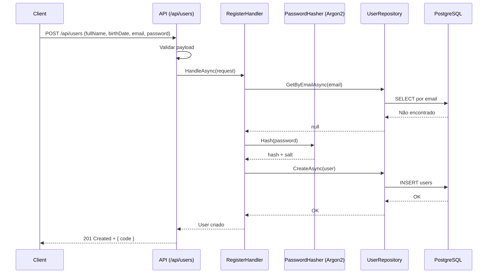
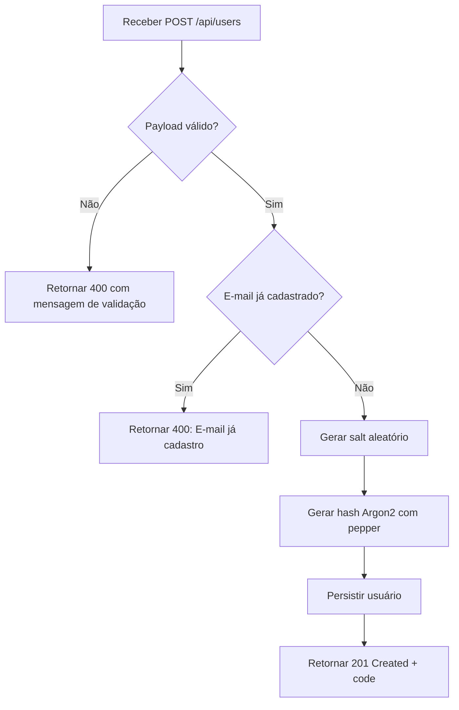
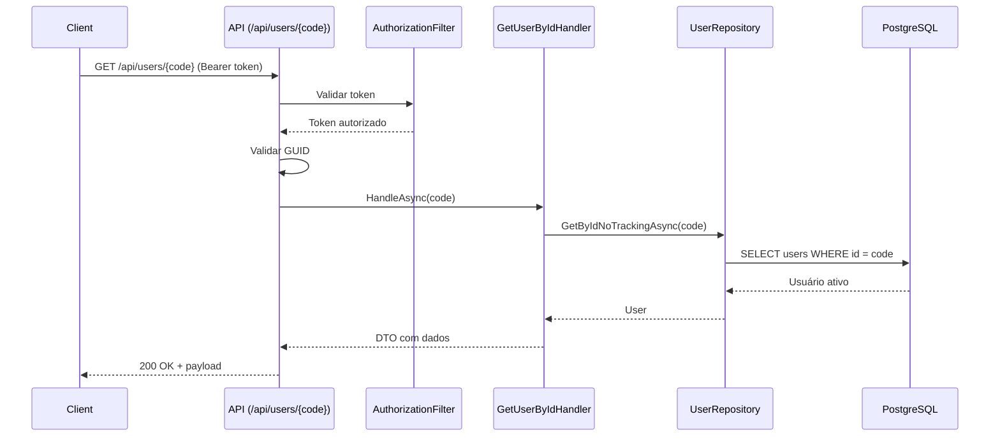

# Feature: User Registration (CRUD de Usuários)

## Visão geral

A feature de **CRUD de usuários** é responsável pelo ciclo de vida dos usuários no sistema, incluindo:

- criação de usuário;
- consulta de usuário;
- atualização de usuário;
- exclusão lógica de usuário.

---

## Inclusão de novos usuários

### Objetivo

Permitir o cadastro de um novo usuário a partir de dados básicos de identificação e autenticação.

### Endpoint

- **Método:** `POST`
- **Rota:** `/api/users`

### Contrato de entrada

Exemplo de payload:

```json
{
  "fullName": "Maria da Silva",
  "birthDate": "1990-01-10",
  "email": "maria.silva@email.com",
  "password": "senha123"
}
```

Campos:

- `fullName` (obrigatório)
- `email` (obrigatório)
- `password` (obrigatório)
- `birthDate` (opcional, formato `yyyy-MM-dd`)

### Contrato de saída

#### Sucesso

- **Status:** `201 Created`
- **Body (exemplo):**

```json
{
  "code": "<user-id-guid>"
}
```

#### Falha de validação/regra de negócio

- **Status:** `400 BadRequest`
- **Body (exemplo):**

```json
{
  "message": "Campo nome é obrigatório"
}
```

---

## Processo de cadastro

1. API recebe requisição de criação de usuário.
2. API valida dados de entrada (camada de validação).
3. Handler da aplicação executa regras de negócio.
4. Sistema verifica se o e-mail já existe.
5. Se e-mail não existe:
   - gera `salt` aleatório único para o usuário;
   - combina senha + `pepper` da aplicação;
   - gera hash irreversível com algoritmo **Argon2**;
   - persiste usuário com `password_hash` e `password_salt`.
6. API retorna `201 Created` com o código do usuário.

---

## Fluxos

### Fluxo principal (sucesso)



### Fluxos alternativos (falha)

1. **Dados inválidos na entrada**  
   API retorna `400` com mensagem específica da validação.

2. **E-mail já cadastrado**  
   Handler identifica duplicidade e retorna `400` com mensagem:  
   `"E-mail já cadastro"`.

3. **Data de nascimento inválida**  
   Quando informada e inválida/futura, retorna `400` com mensagem:  
   `"Data de nascimento inválida"`.

---

## Regras de negócio do cadastro

### Nome (`fullName`)

- Obrigatório.
- Se nulo, vazio ou apenas espaços:  
  `"Campo nome é obrigatório"`
- Menos de 5 caracteres:  
  `"Nome deve conter 5 ou mais caracteres"`
- Mais de 250 caracteres:  
  `"Nome deve conter no máximo 250 caracteres"`

### E-mail (`email`)

- Obrigatório.
- Se nulo, vazio ou apenas espaços:  
  `"Campo e-mail é obrigatório"`
- Formato inválido:  
  `"Campo e-mail está em um formato inválido"`
- E-mail já existente na base:  
  `"E-mail já cadastro"`

### Senha (`password`)

- Obrigatória.
- Se nula, vazia ou apenas espaços:  
  `"O campo senha é obrigatório"`
- Menos de 5 caracteres:  
  `"Senha deve conter 5 ou mais caracteres"`
- Mais de 20 caracteres:  
  `"Senha deve conter no máximo 20 caracteres"`

### Data de nascimento (`birthDate`)

- Campo opcional.
- Se informada, deve ser uma data válida e menor que a data atual.
- Em caso de valor inválido:  
  `"Data de nascimento inválida"`

Exemplos inválidos:

- `2023-02-29` (ano não bissexto)
- data futura
- formato diferente de `yyyy-MM-dd`

---

## Segurança de senha

O cadastro de usuário deve seguir os seguintes requisitos de segurança:

- uso de algoritmo **Argon2** para hash irreversível;
- geração de `salt` aleatório por usuário (nunca fixo);
- uso de `pepper` como secret da aplicação;
- persistência apenas de `password_hash` e `password_salt` no banco;
- `pepper` nunca deve ser persistido no banco.

---

## Diagrama de fluxo (alto nível)



---

## Consulta de usuário por código

### Objetivo

Disponibilizar a consulta dos dados de um usuário específico a partir do seu identificador (`code`). A operação é protegida e requer token válido.

### Endpoint

- **Método:** `GET`
- **Rota:** `/api/users/{code}`
- **Segurança:** Header `Authorization: Bearer <token>` obrigatório.

### Contrato de entrada

Parâmetro de rota obrigatório:

```text
code — GUID do usuário
```

### Contrato de saída

#### Sucesso (`200 OK`)

```json
{
  "code": "<user-id-guid>",
  "fullName": "Maria da Silva",
  "email": "maria@email.com",
  "birthDate": "1990-01-10"
}
```

#### Erros

| Status | Condição | Mensagem |
| --- | --- | --- |
| `400 BadRequest` | `code` não é GUID | `"Código informado é inválido"` |
| `401 Unauthorized` | token ausente ou inválido | resposta padrão `Unauthorized` |
| `404 NotFound` | usuário inexistente ou excluído logicamente | `"Usuário não encontrado."` |

### Fluxo principal (sucesso)



### Fluxos alternativos

1. **Token ausente/inválido** → filtro retorna `401` e a requisição não alcança o controller.
2. **`code` inválido** → controller responde `400` com mensagem específica.
3. **Usuário inexistente ou `IsActive = false`/`DeletedAt != null`** → handler lança `NOT_FOUND` e controller transforma em `404`.

### Regras e validações

- `code` deve ser um GUID válido.
- Usuário precisa estar autenticado com token ativo.
- Usuário retornado deve estar ativo e não excluído logicamente (`IsActive = true` e `DeletedAt = null`).
- A resposta sempre envia `birthDate` no formato `yyyy-MM-dd` quando disponível.

### Diagrama de fluxo

```mermaid
flowchart TD
    start([Receber GET /api/users/{code}]) --> validateToken{Token válido?}
    validateToken -- "Não" --> unauthorized[Retornar 401 Unauthorized]
    validateToken -- "Sim" --> validateCode{code é GUID?}
    validateCode -- "Não" --> invalidCode[Retornar 400 Código informado é inválido]
    validateCode -- "Sim" --> queryUser[Consultar usuário por ID]
    queryUser --> checkStatus{Usuário existe e ativo?}
    checkStatus -- "Não" --> notFound[Retornar 404 Usuário não encontrado]
    checkStatus -- "Sim" --> success[Retornar 200 + dados do usuário]
```

---

## Observações de arquitetura

- A validação de entrada ocorre na **API**.
- As regras de negócio do cadastro ocorrem na camada **Application/Domain**.
- Persistência e detalhes técnicos ficam na camada **Infrastructure**.
- O fluxo respeita o modelo de monólito modular e separação por responsabilidades do projeto.
