# Requisito Funcional: Cadastro de Produtos

## 1. Objetivo

Este documento especifica os requisitos funcionais para o cadastro, alteração, exclusão lógica e consulta de produtos, bem como para a gestão das associações produto–categoria. O documento padroniza entradas, respostas HTTP, validações e regras de negócio.

## 2. Escopo

Inclui as operações:

- inclusão de novo produto;
- alteração de produto existente (campos: barcode, description, unitPrice);
- exclusão lógica de produto;
- associação e remoção de categorias em produto;
- consulta de produtos com filtros dinâmicos.

Ficam fora do escopo:

- alterações diretas nas categorias (exceto associação/desassociação a um produto);
- paginação e regras avançadas de paginação/limite;
- controle granular de permissões por perfil (apenas supositório de autenticação);
- auditoria detalhada (fora do escopo deste documento).

## 3. Premissas e Restrições

- Todas as operações sensíveis exigem autenticação (token no header `Authorization: Bearer <token>`), quando aplicável.
- Os identificadores e rotas devem ser tratados em inglês na API (ex.: `Product`, `productId`, `categoryId`).
- O código do produto é um número inteiro gerado automaticamente pelo sistema.
- Exclusão de produto é lógica (flag `isDeleted`).
- Mensagens de erro e documentação em pt-BR.

## 4. Modelo de Dados

### 4.1 Entidade Product

| Campo | Tipo | Obrigatório | Descrição |
| --- | --- | --- | --- |
| `id` | inteiro | sim | Identificador numérico gerado automaticamente. |
| `barcode` | texto | sim (quando ativo) | Código de barras, único entre produtos ativos. |
| `description` | texto | sim | Descrição do produto. |
| `unitPrice` | decimal | sim | Valor unitário do produto. |
| `categories` | lista de inteiros | sim (>=1) | Lista de `categoryId` aos quais o produto pertence. |
| `isDeleted` | booleano | sim | Flag de exclusão lógica. |
| `createdAt` | datetime | sim | Data de criação. |
| `updatedAt` | datetime | sim | Data da última atualização. |
| `deletedAt` | datetime nula | não | Data de exclusão lógica, quando aplicável. |

### 4.2 Regras de integridade

- Um produto excluído logicamente permanece no banco, mas não deve ser retornado em consultas operacionais.
- `barcode` deve ser único entre produtos com `isDeleted = false`. A unicidade pode ser garantida por regra de aplicação ou índice parcial no banco.
- Todo produto ativo deve possuir pelo menos 1 categoria associada.

## 5. Regras Gerais de Validação

### 5.1 Campos obrigatórios

- Na criação: `barcode`, `description`, `unitPrice` e `categories` são obrigatórios.
- Em alteração: `barcode`, `description` e `unitPrice` são obrigatórios; `categories` não é alterado por esse endpoint.

### 5.2 Validações específicas

- `barcode`: não pode estar em uso por outro produto ativo (mensagem: "Código de barras já utilizado").
- `description`: deve conter conteúdo significativo (mínimo de 3 caracteres, máximo de 250 caracteres).
- `unitPrice`: deve ser maior ou igual a 0.
- `categories`: cada `categoryId` informado deve existir e não estar excluído; lista deve ter ao menos 1 item.

### 5.3 Tratamento de inexistência

- Produto inexistente ou excluído: retornar `404 Not Found` quando aplicável.
- Categoria inexistente ou excluída: retornar `400 Bad Request` com mensagem "Categoria inválida" nas operações de associação/desassociação.

## 6. Requisitos Funcionais

### RF-01 - Criar produto

**API:**  
- Metodo: `POST`  
- Rota: `/products`

**Segurança:**
- Autenticação obrigatória via bearer token no header `Authorization`.

**Entrada:**
- Payload JSON com `barcode`, `description`, `unitPrice` e `categories`.

```json
{ "barcode": "...", "description": "...", "unitPrice": 12.34, "categories": [1,2] }
```

**Saídas:** 
- `201 Created`: produto criado com sucesso e header `Location: /products/{id}`.
- `400 Bad Request`: payload inválido, categorias inválidas ou `barcode` duplicado (`"Código de barras já utilizado"`).
- `401 Unauthorized`: token ausente, inválido ou expirado.
- `5xx Internal Server Error`: erro inesperado.

**Regras de negócio aplicáveis:**
- `id` do produto é gerado automaticamente.
- `barcode` deve ser único entre produtos ativos.
- Produto deve possuir ao menos 1 categoria válida (existente e não excluída).

**Critérios de aceite:**
- [ ] Deve retornar `401 Unauthorized` sem token válido.
- [ ] Deve retornar `400 Bad Request` para payload inválido.
- [ ] Deve retornar `400 Bad Request` com mensagem `"Código de barras já utilizado"` para barcode duplicado.
- [ ] Deve retornar `201 Created` para payload válido.

**Cenários de testes:**
- inclusão sem token;
- inclusão com `barcode` já utilizado;
- inclusão com categoria inexistente/excluída;
- inclusão com `categories` vazio;
- inclusão com `unitPrice` negativo;
- inclusão com dados válidos.

**Fluxo:**

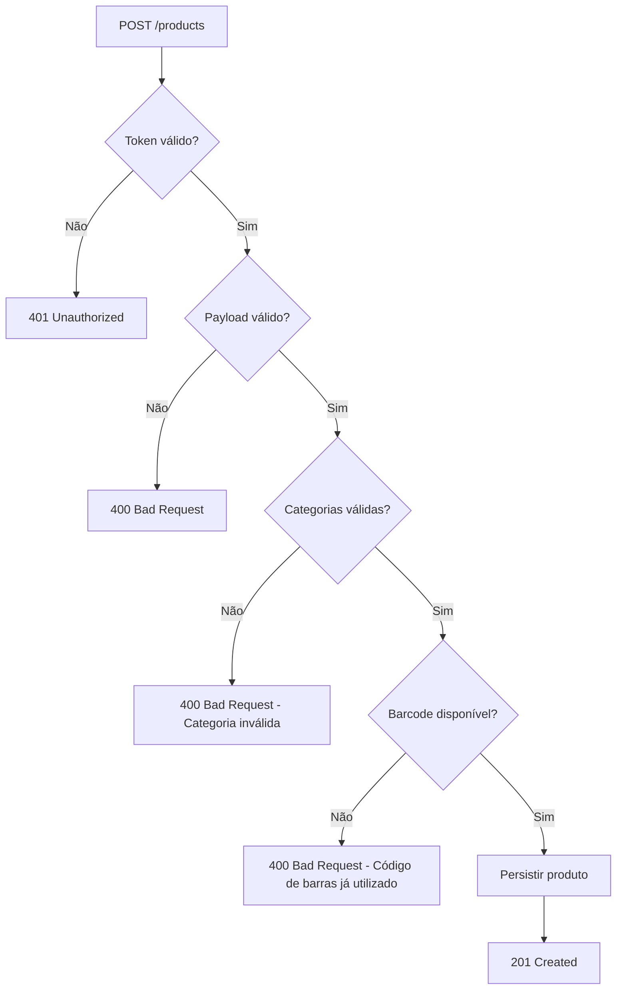

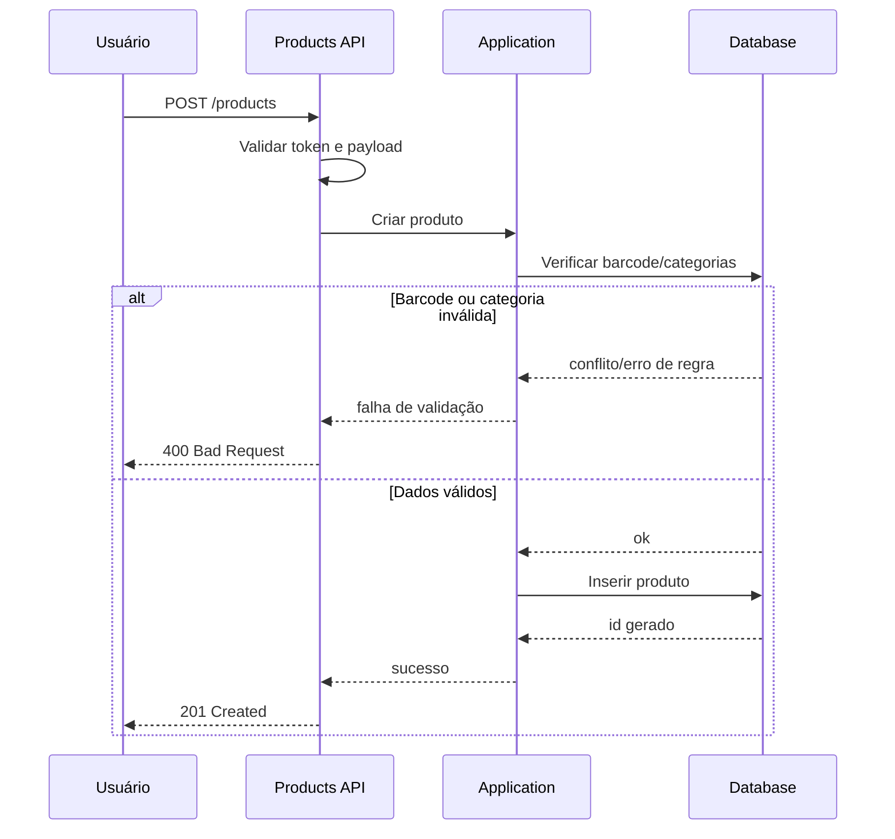

### RF-02 - Alterar produto

**API:**  
- Metodo: `PUT`  
- Rota: `/products/{id}`

**Segurança:**
- Autenticação obrigatória via bearer token no header `Authorization`.

**Entrada:**
- `id` na rota.
- Payload JSON com `barcode`, `description` e `unitPrice`.

```json
{ "barcode": "...", "description": "...", "unitPrice": 12.34 }
```

**Saídas:** 
- `204 No Content`: atualização realizada com sucesso.
- `400 Bad Request`: `barcode` já utilizado por outro produto (`"Código de barras já utilizado."`) ou payload inválido.
- `401 Unauthorized`: token ausente, inválido ou expirado.
- `404 Not Found`: produto inexistente ou excluído.

**Regras de negócio aplicáveis:**
- Categorias não são alteradas neste requisito.
- Produto deve existir e estar ativo.
- `barcode` não pode colidir com outro produto ativo.

**Critérios de aceite:**
- [ ] Deve retornar `401 Unauthorized` sem token válido.
- [ ] Deve retornar `404 Not Found` para produto inexistente/excluído.
- [ ] Deve retornar `400 Bad Request` para conflito de barcode.
- [ ] Deve retornar `204 No Content` para alteração válida.

**Cenários de testes:**
- alteração sem token;
- alteração de produto inexistente;
- alteração de produto excluído;
- alteração com barcode já utilizado por outro produto;
- alteração com payload válido mantendo barcode;
- alteração com payload válido trocando barcode.

**Fluxo:**

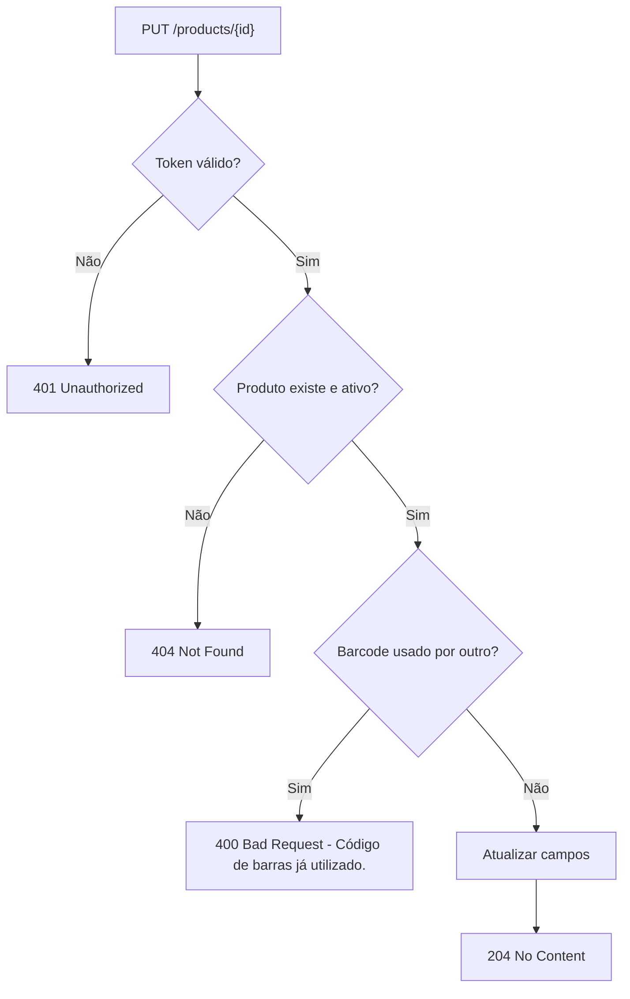

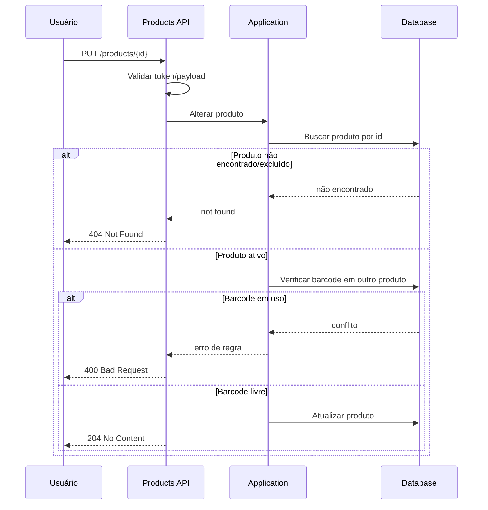

### RF-03 - Excluir produto (lógica)

**API:**  
- Metodo: `DELETE`  
- Rota: `/products/{id}`

**Segurança:**
- Autenticação obrigatória via bearer token no header `Authorization`.

**Entrada:**
- `id` do produto na rota.

**Saídas:** 
- `204 No Content`: produto ativo excluído logicamente.
- `401 Unauthorized`: token ausente, inválido ou expirado.
- `404 Not Found`: produto inexistente ou já excluído.
- `5xx Internal Server Error`: erro inesperado.

**Regras de negócio aplicáveis:**
- Exclusão é lógica (`isDeleted = true` e preenchimento de `deletedAt`).
- Ao excluir, `barcode` deve ser limpo/removido para permitir reutilização.

**Critérios de aceite:**
- [ ] Deve retornar `401 Unauthorized` sem token válido.
- [ ] Deve retornar `404 Not Found` para produto inexistente ou já excluído.
- [ ] Deve retornar `204 No Content` para produto ativo.
- [ ] Deve liberar o barcode para reutilização após exclusão.

**Cenários de testes:**
- exclusão sem token;
- exclusão de produto inexistente;
- exclusão de produto já excluído;
- exclusão de produto ativo;
- criação de novo produto reutilizando barcode de produto excluído.

**Fluxo:**

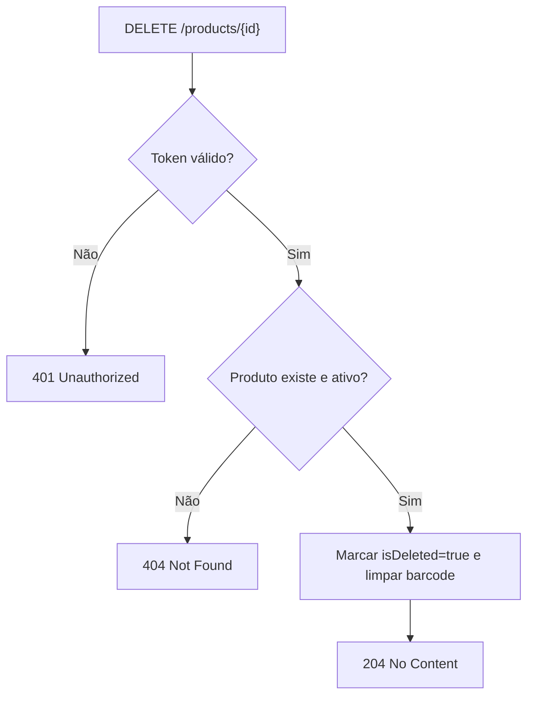

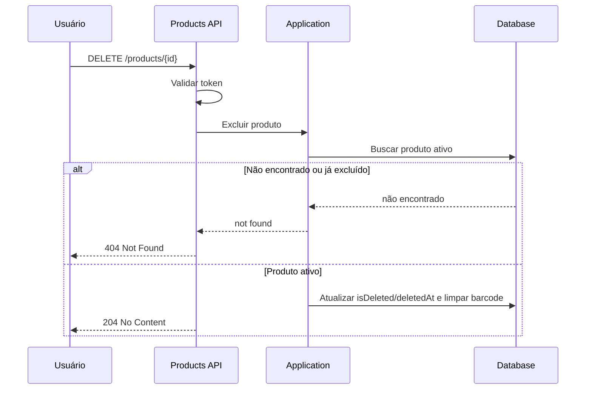

### RF-04 - Adicionar categoria a um produto

**API:**  
- Metodo: `POST`  
- Rota: `/products/{productId}/categories/{categoryId}`

**Segurança:**
- Autenticação obrigatória via bearer token no header `Authorization`.

**Entrada:**
- `productId` e `categoryId` informados na rota.

**Saídas:** 
- `201 Created`: associação produto-categoria criada.
- `204 No Content`: associação já existia.
- `400 Bad Request`: categoria inexistente/excluída (`"Categoria inválida"`).
- `401 Unauthorized`: token ausente, inválido ou expirado.
- `404 Not Found`: produto inexistente ou excluído.

**Regras de negócio aplicáveis:**
- Produto deve existir e estar ativo.
- Categoria deve existir e estar ativa.
- Associação duplicada não deve ser recriada.

**Critérios de aceite:**
- [ ] Deve retornar `401 Unauthorized` sem token válido.
- [ ] Deve retornar `404 Not Found` para produto inexistente/excluído.
- [ ] Deve retornar `400 Bad Request` com `"Categoria inválida"` para categoria inválida.
- [ ] Deve retornar `204 No Content` quando associação já existir.
- [ ] Deve retornar `201 Created` quando associação for criada.

**Cenários de testes:**
- adicionar categoria sem token;
- adicionar categoria em produto inexistente/excluído;
- adicionar categoria inexistente/excluída;
- adicionar categoria já associada;
- adicionar categoria válida ainda não associada.

**Fluxo:**

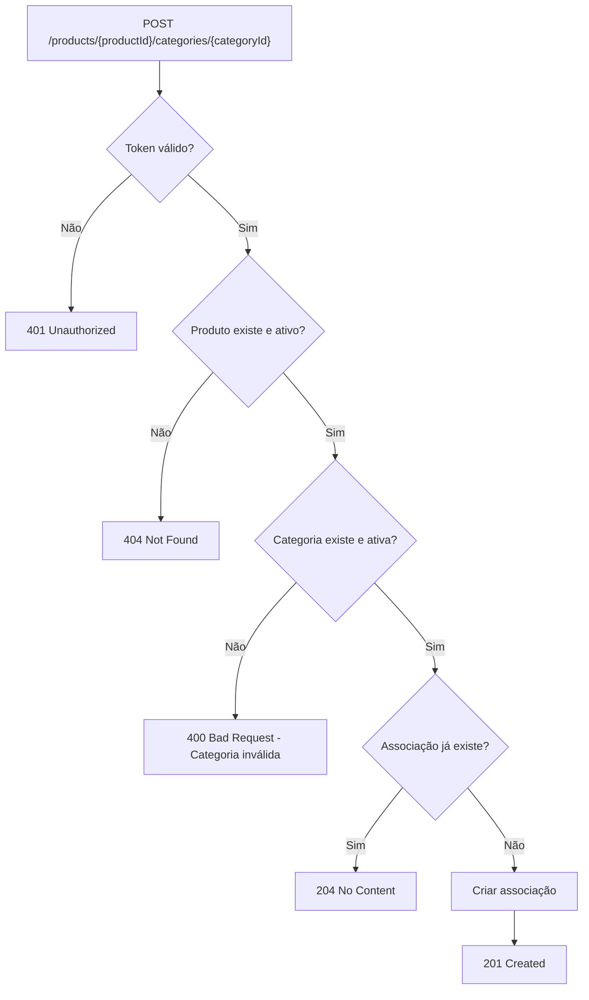

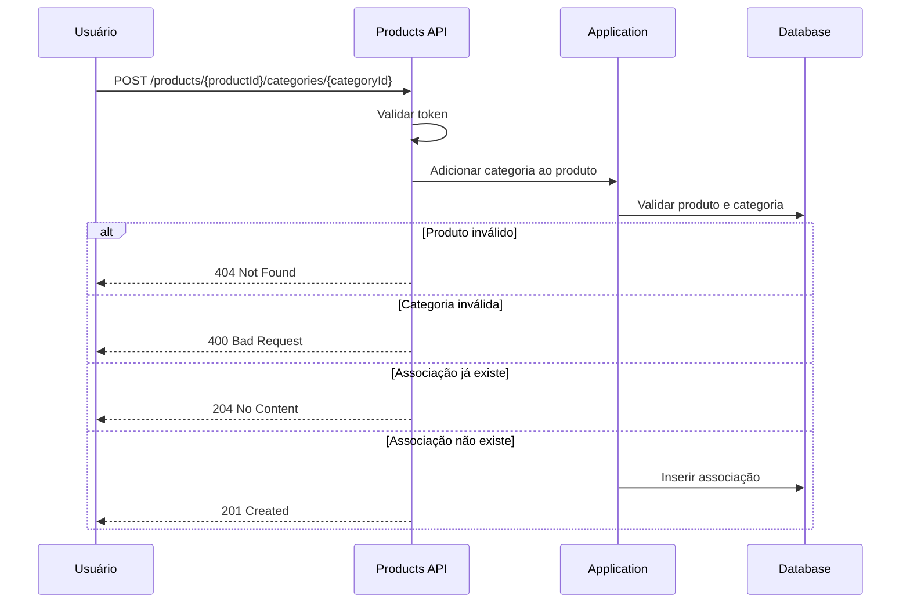

### RF-05 - Excluir categoria de um produto

**API:**  
- Metodo: `DELETE`  
- Rota: `/products/{productId}/categories/{categoryId}`

**Segurança:**
- Autenticação obrigatória via bearer token no header `Authorization`.

**Entrada:**
- `productId` e `categoryId` informados na rota.

**Saídas:** 
- `204 No Content`: associação removida com sucesso.
- `400 Bad Request`: categoria não associada (`"Categoria inválida"`) ou tentativa de remover última categoria (`"O produto deve ter ao menos 1 categoria"`).
- `401 Unauthorized`: token ausente, inválido ou expirado.
- `404 Not Found`: produto inexistente ou excluído.

**Regras de negócio aplicáveis:**
- Produto deve existir e estar ativo.
- Categoria deve estar associada ao produto.
- Produto não pode ficar sem categorias.

**Critérios de aceite:**
- [ ] Deve retornar `401 Unauthorized` sem token válido.
- [ ] Deve retornar `404 Not Found` para produto inexistente/excluído.
- [ ] Deve retornar `400 Bad Request` com `"Categoria inválida"` quando não houver associação.
- [ ] Deve retornar `400 Bad Request` com `"O produto deve ter ao menos 1 categoria"` ao tentar remover a última categoria.
- [ ] Deve retornar `204 No Content` quando remoção for válida.

**Cenários de testes:**
- excluir categoria sem token;
- excluir categoria de produto inexistente/excluído;
- excluir categoria não associada;
- excluir última categoria do produto;
- excluir categoria válida mantendo ao menos uma categoria associada.

**Fluxo:**

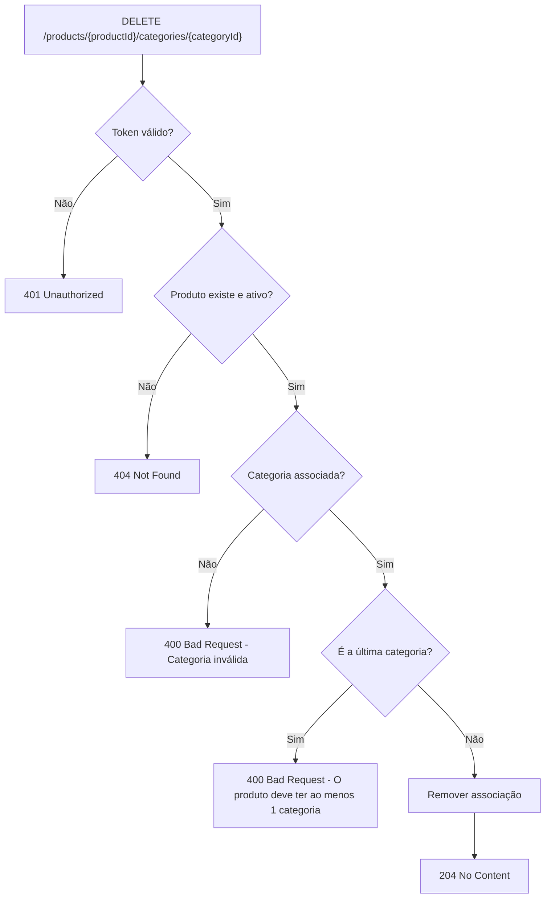

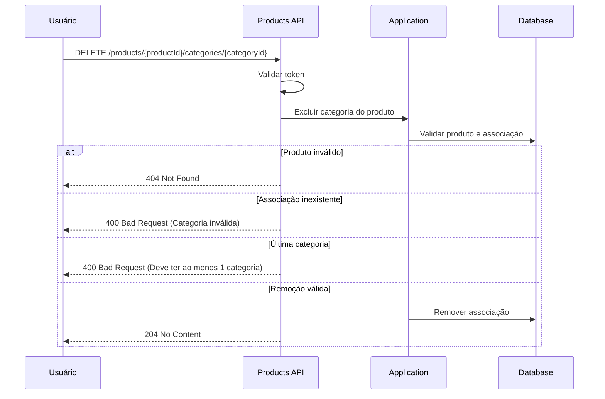

### RF-06 - Consultar produtos (filtro dinâmico)

**API:**  
- Metodo: `GET`  
- Rota: `/products`

**Segurança:**
- Autenticação obrigatória via bearer token no header `Authorization`.

**Entrada:**
- Query params opcionais: `id`, `description`, `categoryId`, `barcode`, `includeCategories`, `sort`.
- Filtros devem ser combinados com `AND`.

Exemplo:

```text
GET /products?id=10&description=suco&categoryId=2&includeCategories=true&sort=-unitPrice
```

**Saídas:** 
- `200 OK`: lista de produtos encontrados.
- `404 Not Found`: nenhum produto encontrado (`"Nenhum produto encontrado"`).
- `401 Unauthorized`: token ausente, inválido ou expirado.
- `400 Bad Request`: parâmetros inválidos.

**Regras de negócio aplicáveis:**
- Considerar apenas produtos não excluídos.
- `includeCategories=true` inclui categorias associadas no retorno.
- Ordenação deve respeitar o campo recebido em `sort`.

**Critérios de aceite:**
- [ ] Deve retornar `401 Unauthorized` sem token válido.
- [ ] Deve aplicar todos os filtros em conjunto (`AND`).
- [ ] Deve retornar `404 Not Found` com `"Nenhum produto encontrado"` quando não houver resultados.
- [ ] Deve retornar `200 OK` quando houver resultados.
- [ ] Deve respeitar `includeCategories` e `sort` quando informados.

**Cenários de testes:**
- consulta sem token;
- consulta por `id` exato;
- consulta por `description` parcial;
- consulta combinando múltiplos filtros;
- consulta com `includeCategories=true`;
- consulta sem resultados.

**Fluxo:**

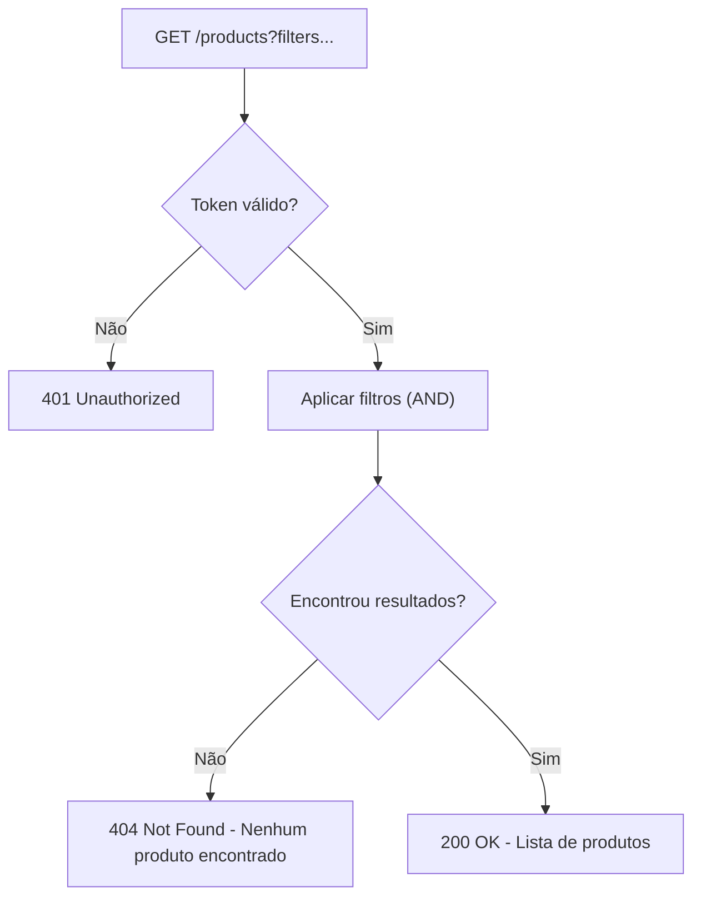

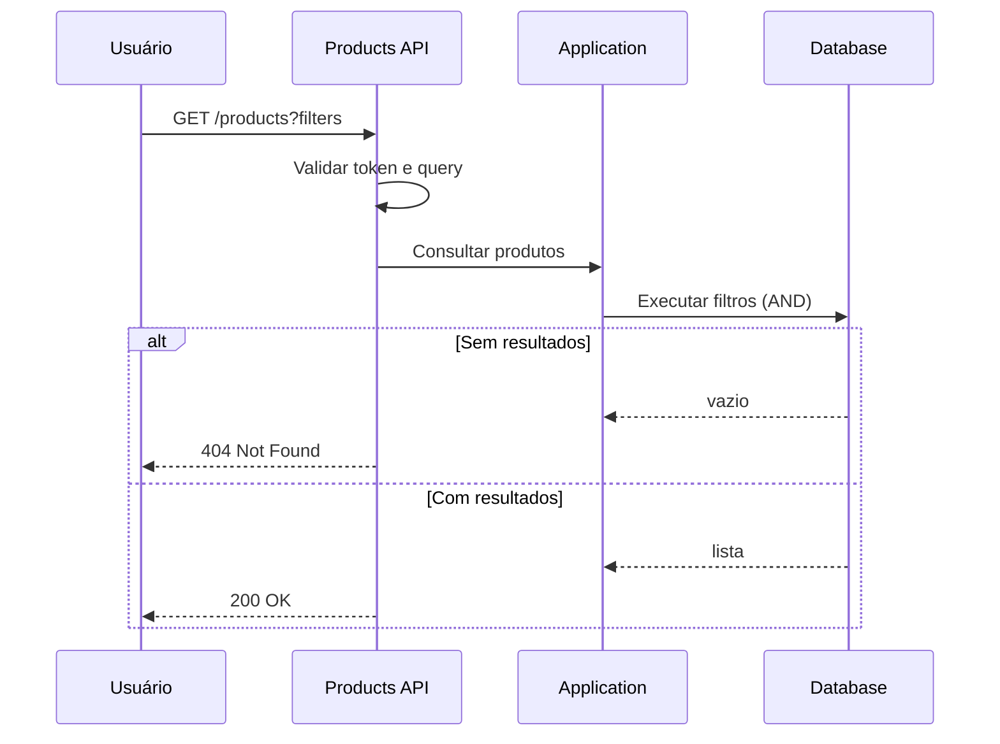

## 7. Respostas HTTP Padronizadas

| Operação | Sucesso | Token inválido | Não encontrado | Validação inválida |
| --- | ---: | ---: | ---: | --- |
| Criar produto | `201 Created` | `401 Unauthorized` | - | `400 Bad Request` |
| Alterar produto | `204 No Content` | `401 Unauthorized` | `404 Not Found` | `400 Bad Request` |
| Excluir produto | `204 No Content` | `401 Unauthorized` | `404 Not Found` | - |
| Adicionar categoria | `201 Created` / `204 No Content` | `401 Unauthorized` | `404 Not Found` | `400 Bad Request` |
| Excluir categoria | `204 No Content` | `401 Unauthorized` | `404 Not Found` | `400 Bad Request` |
| Consultar produtos | `200 OK` | `401 Unauthorized` | `404 Not Found` | `400 Bad Request` |

## 8. Mensagens de Erro Padronizadas

- "Código de barras já utilizado" — uso duplicado de `barcode`.
- "Categoria inválida" — categoria inexistente ou excluída, ou não associada conforme contexto.
- "O produto deve ter ao menos 1 categoria" — impede remoção quando restaria zero categorias.
- "Nenhum produto encontrado" — retorno quando consulta não traz resultados.

## 9. Observações de Persistência e Implementação

- Usar exclusão lógica (`isDeleted` / `deletedAt`) e liberar `barcode` ao excluir (definir `barcode = NULL` ou string vazia).
- Recomenda-se implementar unicidade de `barcode` via índice parcial no banco (ex.: índice único onde `is_deleted = false`) quando o SGBD suportar; caso contrário, garantir unicidade via regra de aplicação com transação.
- Mapear nomes de tabela/colunas seguindo convenções do projeto (ex.: snake_case para PostgreSQL).
- Validar relações de categoria antes de persistir alterações de produto.

## 10. Requisitos Não Funcionais

- A API deve seguir convenção REST e OpenAPI 3.0 para documentação.
- Validações de entrada devem ocorrer na camada API; regras de negócio na Application/Domain.
- Operações assíncronas devem aceitar `CancellationToken`.
- Segredos e configurações devem ser armazenados em local seguro (secret manager/configuration).

## 11. Cenários de Teste e Considerações para QA

- Testes unitários para validações: `barcode` duplicado, categorias inexistentes, remoção de última categoria.
- Testes de integração cobrindo fluxo completo de criação, associação de categorias, alteração e exclusão lógica.
- Testes de contrato (OpenAPI) para garantir respostas e códigos HTTP esperados.

---
Este requisito deve ser utilizado como referência para implementação, validação e testes do cadastro de produtos. Ajustes que afetem contratos públicos devem atualizar este artefato.
