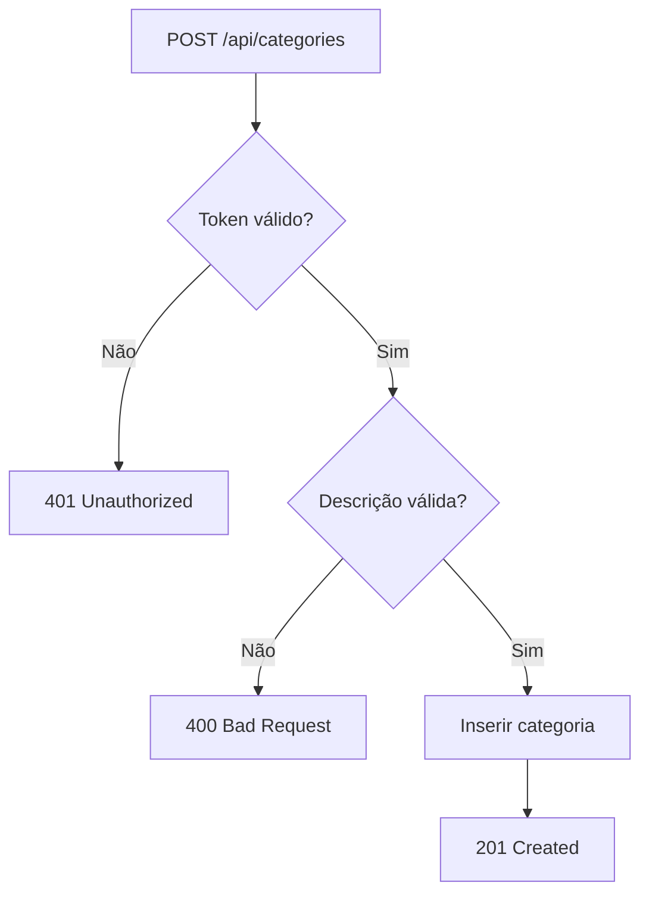
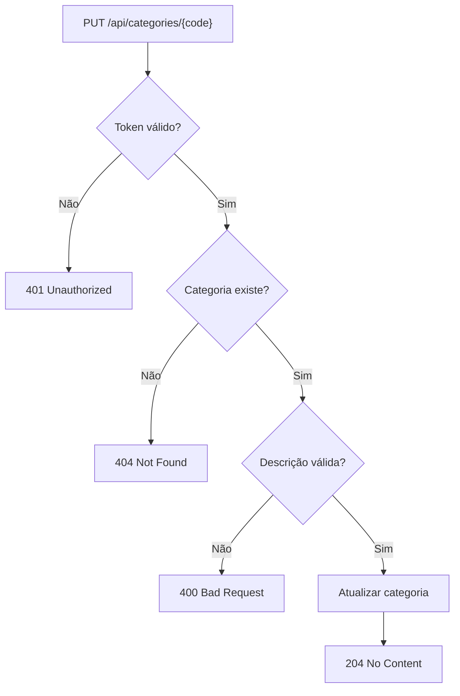
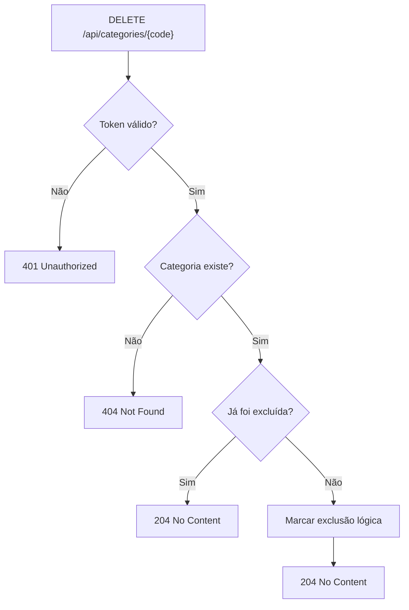
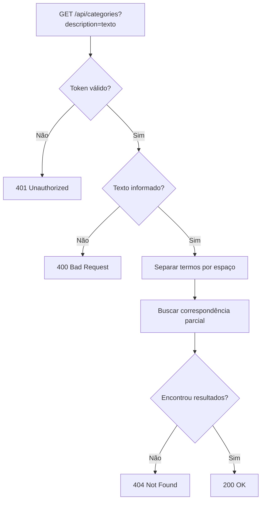
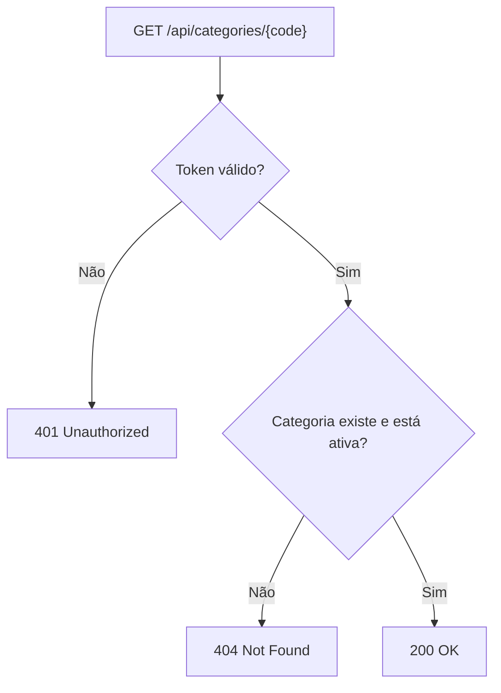

# Requisito Funcional: Cadastro de Categorias de Produtos

## 1. Objetivo

Este documento especifica os requisitos funcionais para o cadastro de categorias de produtos, contemplando as operações de criação, alteração, exclusão lógica e consulta.

A categoria de produto representa um agrupador de itens do domínio e possui identificador numérico gerado automaticamente pelo banco de dados.

## 2. Escopo

O escopo desta especificação inclui:

- inclusão de nova categoria;
- alteração de categoria existente;
- exclusão lógica de categoria;
- consulta de categorias por descrição;
- consulta de uma categoria por código.

Ficam fora do escopo:

- relacionamento entre produtos e categorias;
- regras de ordenação da listagem;
- paginação;
- controle de permissões por perfil;
- auditoria detalhada de alterações.

## 3. Premissas e Restrições

- Todas as operações exigem autenticação.
- O token deve ser enviado no header `Authorization` no formato `Bearer <token>`.
- O código da categoria é gerado automaticamente pelo sistema.
- A exclusão de categoria é lógica.
- O sistema deve seguir os padrões de resposta HTTP definidos neste documento.
- Os identificadores e rotas devem ser tratados em inglês na API.

## 4. Modelo de Dados

### 4.1 Entidade de Categoria

| Campo | Tipo | Obrigatório | Descrição |
| --- | --- | --- | --- |
| `code` | inteiro | sim | Identificador gerado automaticamente. |
| `description` | texto | sim | Descrição da categoria. |
| `isActive` | booleano | sim | Indica se a categoria está ativa. |
| `createdAt` | data/hora | sim | Data de criação do registro. |
| `updatedAt` | data/hora | sim | Data da última atualização. |
| `deletedAt` | data/hora nula | não | Data da exclusão lógica, quando aplicável. |

### 4.2 Regra de Integridade

Uma categoria excluída logicamente continua persistida no banco de dados, porém deve ser desconsiderada nas consultas operacionais.

## 5. Regras Gerais de Validação

### 5.1 Descrição da categoria

- deve conter no mínimo 5 caracteres;
- deve conter no máximo 50 caracteres;
- deve conter apenas letras e números;
- pode conter letras acentuadas;
- não pode conter caracteres especiais;
- pode conter espaços internos.

### 5.2 Critério de interpretação da consulta textual

Quando a consulta receber múltiplos termos separados por espaço, cada termo deve ser considerado independentemente, e o resultado deve retornar categorias que contenham ao menos um dos termos informados.

### 5.3 Tratamento de inexistência

- Consulta por código inexistente: retornar `404 Not Found`.
- Consulta textual sem resultados: retornar `404 Not Found`.
- Alteração de categoria inexistente: retornar `404 Not Found`.
- Exclusão de categoria inexistente: retornar `404 Not Found`.

---

# 6. Requisitos Funcionais

## 6.1 RF-01 — Criar categoria

O sistema deve permitir o cadastro de uma nova categoria de produtos informando apenas a descrição.

### Entradas

- `description`

### Saídas

- código da categoria gerado automaticamente;
- resposta `201 Created` em caso de sucesso.

### Regras aplicáveis

- autenticação obrigatória;
- validação da descrição;
- geração automática do código.

### Critérios de aceite

- Sem token válido, a operação deve retornar `401 Unauthorized`.
- Com descrição inválida, a operação deve retornar `400 Bad Request` com mensagem informativa descrevendo o que está inválido.
- Com dados válidos, a operação deve retornar `201 Created`.

### Cenários de teste

- incluir sem token;
- incluir com descrição menor que 5 caracteres;
- incluir com descrição maior que 50 caracteres;
- incluir com caracteres especiais;
- incluir com acentuação válida;
- incluir com dados válidos.

### Testes de mutação

- remover a validação do token;
- remover o limite mínimo de caracteres;
- remover a validação de caracteres permitidos;
- inverter a condição de validação da descrição.

### Testes de borda

- descrição com exatamente 5 caracteres;
- descrição com exatamente 50 caracteres;
- descrição com apenas letras acentuadas;
- descrição com apenas números.

### Fluxo



---

## 6.2 RF-02 — Alterar categoria

O sistema deve permitir a alteração da descrição de uma categoria existente, identificada pelo código.

### Entradas

- `code`
- `description`

### Saídas

- resposta `204 No Content` em caso de sucesso.

### Regras aplicáveis

- autenticação obrigatória;
- a categoria deve existir;
- a nova descrição deve ser válida.

### Critérios de aceite

- Sem token válido, a operação deve retornar `401 Unauthorized`.
- Se a categoria não existir, a operação deve retornar `404 Not Found`.
- Se a descrição for inválida, a operação deve retornar `400 Bad Request`.
- Se os dados forem válidos, a operação deve retornar `204 No Content`.

### Cenários de teste

- alterar sem token;
- alterar com código inexistente;
- alterar com descrição inválida;
- alterar com dados válidos;
- alterar mantendo a mesma descrição.

### Testes de mutação

- remover a verificação de existência;
- remover a validação da descrição;
- remover a persistência da alteração;
- alterar o fluxo para retornar sucesso sem atualizar o banco.

### Testes de borda

- descrição com exatamente 5 caracteres;
- descrição com exatamente 50 caracteres;
- código no menor valor válido;
- atualização com a mesma descrição já cadastrada.

### Fluxo



---

## 6.3 RF-03 — Excluir categoria

O sistema deve permitir a exclusão lógica de uma categoria de produtos identificada pelo código.

### Entradas

- `code`

### Saídas

- resposta `204 No Content` em caso de sucesso;
- `404 Not Found` quando a categoria não existir.

### Regras aplicáveis

- autenticação obrigatória;
- a exclusão deve ser lógica;
- categorias já excluídas devem manter resposta de sucesso sem erro.

### Critérios de aceite

- Sem token válido, a operação deve retornar `401 Unauthorized`.
- Se a categoria não existir, a operação deve retornar `404 Not Found`.
- Se a categoria existir e já estiver excluída, a operação deve retornar `204 No Content`.
- Se a categoria existir e estiver ativa, a operação deve marcar exclusão lógica e retornar `204 No Content`.

### Cenários de teste

- excluir sem token;
- excluir categoria inexistente;
- excluir categoria já excluída;
- excluir categoria ativa.

### Testes de mutação

- remover a validação de existência;
- transformar a exclusão lógica em exclusão física;
- remover a marcação de exclusão;
- permitir retorno de sucesso sem alterar o estado.

### Testes de borda

- excluir categoria recém-criada;
- excluir categoria já marcada como excluída;
- excluir com código em limite superior suportado.

### Fluxo



---

## 6.4 RF-04 — Consultar categorias por descrição

O sistema deve permitir a consulta de categorias por parte da descrição informada.

### Entradas

- `description`

### Saídas

- lista de categorias compatíveis;
- `404 Not Found` quando não houver resultados.

### Regras aplicáveis

- autenticação obrigatória;
- a pesquisa deve aceitar múltiplos termos separados por espaço;
- a pesquisa deve retornar categorias que contenham ao menos um dos termos;
- apenas categorias ativas e não excluídas devem ser consideradas.

### Critérios de aceite

- Sem token válido, a operação deve retornar `401 Unauthorized`.
- Se a consulta estiver vazia, a operação deve retornar `400 Bad Request`.
- Se não houver resultados, a operação deve retornar `404 Not Found`.
- Se houver resultados, a operação deve retornar `200 OK`.

### Cenários de teste

- consultar sem token;
- consultar com texto vazio;
- consultar com um termo;
- consultar com múltiplos termos;
- consultar sem resultados;
- consultar com resultados parciais.

### Testes de mutação

- remover o processamento dos termos por espaço;
- substituir correspondência parcial por correspondência exata;
- remover o filtro de categorias inativas;
- remover o filtro de exclusão lógica.

### Testes de borda

- consulta com apenas um caractere;
- consulta com múltiplos espaços;
- consulta com termos duplicados;
- consulta que retorna exatamente um resultado.

### Fluxo



### Exemplo de resposta

```json
[
  {
    "code": 1,
    "description": "Bebidas"
  },
  {
    "code": 2,
    "description": "Quentes"
  }
]
```

---

## 6.5 RF-05 — Consultar categoria por código

O sistema deve permitir a consulta de uma categoria específica por meio do código.

### Entradas

- `code`

### Saídas

- descrição da categoria;
- `404 Not Found` quando a categoria não existir.

### Regras aplicáveis

- autenticação obrigatória;
- a categoria deve existir e estar ativa;
- categorias excluídas logicamente não devem ser retornadas.

### Critérios de aceite

- Sem token válido, a operação deve retornar `401 Unauthorized`.
- Se a categoria não existir, a operação deve retornar `404 Not Found`.
- Se a categoria existir, a operação deve retornar `200 OK` com a descrição.

### Cenários de teste

- consultar sem token;
- consultar categoria inexistente;
- consultar categoria excluída logicamente;
- consultar categoria ativa.

### Testes de mutação

- remover a validação de existência;
- ignorar o estado de exclusão lógica;
- alterar o contrato de resposta;
- retornar sucesso sem carregar a entidade.

### Testes de borda

- consultar com o menor código válido;
- consultar com um código muito alto;
- consultar uma categoria recém-criada.

### Fluxo



### Exemplo de resposta

```json
{
  "description": "Bebidas"
}
```

---

# 7. Respostas HTTP Padronizadas

| Operação | Sucesso | Token inválido | Não encontrado | Validação inválida |
| --- | --- | --- | --- | --- |
| Criar categoria | `201 Created` | `401 Unauthorized` | - | `400 Bad Request` |
| Alterar categoria | `204 No Content` | `401 Unauthorized` | `404 Not Found` | `400 Bad Request` |
| Excluir categoria | `204 No Content` | `401 Unauthorized` | `404 Not Found` | - |
| Consultar categorias | `200 OK` | `401 Unauthorized` | `404 Not Found` | `400 Bad Request` |
| Consultar por código | `200 OK` | `401 Unauthorized` | `404 Not Found` | - |

# 8. Requisitos Não Funcionais

- A API deve seguir a convenção REST.
- As validações devem ocorrer antes da persistência.
- A exclusão lógica deve preservar histórico do registro.
- O documento deve permanecer legível e compatível com renderização Markdown.

# 9. Considerações Finais

Este requisito formaliza o comportamento esperado do cadastro de categorias de produtos e deve ser utilizado como referência para implementação, validação e testes.

A solução deve manter:

- autenticação obrigatória;
- respostas HTTP consistentes;
- exclusão lógica;
- validação clara da descrição;
- rastreabilidade das operações.
